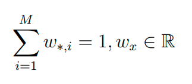
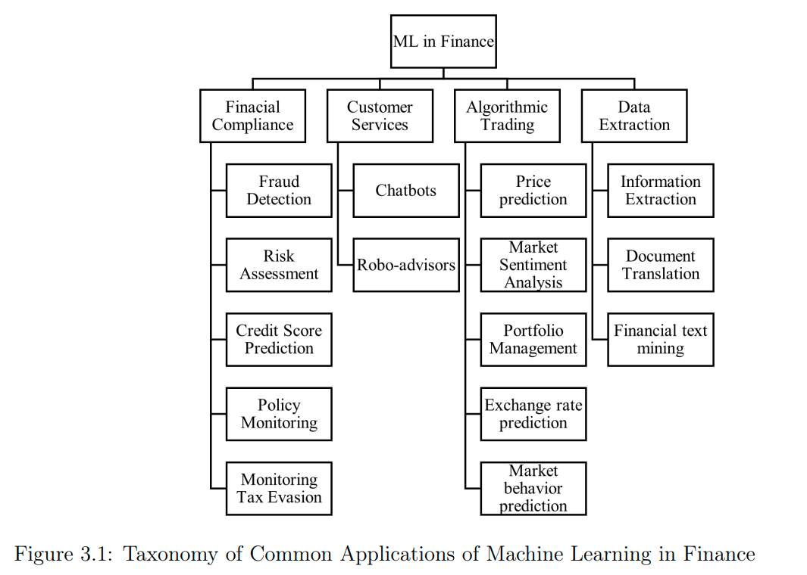
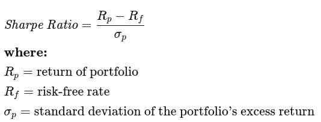

# Model-Free Reinforcement Learning for Asset Allocation

Remarks
* Authors - Carnegie Mellon University (qs 52), JP Morgan, Africa
* https://www.linkedin.com/in/srijansood/
* 
* 

## 1. Introduction

### 1.1 Background

Asset allocation (or portfolio management) is the task of determining how to optimally allocate funds of a finite budget into a range of financial instruments/assets
such as stocks (Filos, 2019). Coming up with a profitable trading strategy involves
making critical decisions on allocating capital into different stock options. Usually,
this allocation should maximize the expected return while minimizing the investment
risks involved (Gao et al., 2021)

While many of these state-of-the-art models achieve good results, there are some
limitations
1. First, they are **overly reliant on using predictive models** (Adämmer &
Schüssler, 2020). These predictive models are not usually too successful at predicting
the financial markets since these markets are highly stochastic and thus are very
difficult to predict accurately
1. many of these models make simplistic and usually **unrealistic assumptions
around the financial signals’** second-order and higher-order statistical moments (Gao
et al., 2021).
1. Finally, these models are usually limited to **discrete action spaces** to
make the resulting models tractable to solve

### 1.3 Aim and Objectives

This study investigates the effectiveness of model-free deep reinforcement learning
agents with portfolio management. The specific objectives are:
* Training RL agents on real-world prices of a finite set of stocks to optimally
allocate a finite cash budget into a range of securities in a portfolio.
* Comparing the performance of RL agents to baseline agents.
* Comparing the performance of value-based RL agents to policy-based RL
agents.
* Comparing the performance of off-policy RL agents to on-policy RL agents.

### 1.4 Research Questions
At the end of this report, we should be able to answer the following questions:
1. How well can RL agents perform the task of portfolio management?
2. Are RL agents markedly better than the classical state-of-the-art portfolio
management techniques?
3. Are there certain classes of RL agents that are consistently better at portfolio
management?

### others
* Since Harry Markowitz proposed the idea of portfolio formation in 1952 to improve
expected rewards and reduce the investment risk, portfolio trading has been the
dominant strategy for many traders
* This study aims to
understand if RL can uncover strategies for portfolio management that yield better
results than the current state of the art methods.

## 2. Portfolio Management

* Portfolio management involves selecting and managing a collection of assets in order
to meet long-term financial goals while adhering to a risk tolerance level. 
* Diversification and portfolio optimization are critical components of efficient portfolio managemen
* What is a Portfolio ?
    * A portfolio is a collection of several financial assets.
* What is Portfolio optmisation ?
    * Portfolio optimization is the process of determining the optimum portfolio from a set of all possible portfolios with a specific goal in mind.

### 2.2 Markowitz Model
* The Markowitz model (Markowitz, 1952) is regarded as one of the first efforts to
codify and propose an optimization strategy for portfolio management mathematically. 
* discovering a portfolio vector w among a universe of M assets
* The Markowitz model gives the optimal portfolio vector w∗ which minimizes volatility for a given return level
* 
* The Markowitz model assumes that the investor is risk-averse
* gives a maximum return for a given risk or minimum risk for given returns
* optimal portfolio is selected as follows
    * From a set of portfolios with the same return, the investor will prefer the portfolio with the lower risk.
    * From a set of portfolios with the same risk, the investor will choose the portfolio with the highest return.
* Problems
    * this is a single-period investment model i.e. choice to distribute assets is made only at the start of the term and not at any other point. The repercussions of this decision can only be seen after the term, and no additional action may be taken during that time
    * it is **not ideal for continuous-time situations**

### 2.3 Modern Portfolio Theory
* MPT is a mathematical framework for constructing a portfolio of assets to maximize the expected return for a given amount of risk
* the standard deviation of all returns to assess the risk of a specific portfolio
* efficient frontier
* Diversification

### 2.4 Post-modern Portfolio Theory
* It uses the downside risk of returns rather than the expected variance of investment returns employed by MPT
* Downside risk is the risk of loss in an investment or portfolio.
*  The MPT is based on symmetrical risk, whereas the PMPT is based on asymmetrical risk
* The downside risk is quantified by target semi-deviation, also known as downside
deviation, and it reflects what investors dread the most: negative returns 
* symmetrical risk : potential gain or loss is kind of similar, assymetrical risk is loss or gain may not be symmetrical

## 3. Survey of Machine Learning in Finance

### 3.1 Introduction

### 3.2 RL Applications in Portfolio Management

* Jiang, Z., Xu, D., & Liang, J. (2017, July). A Deep Reinforcement Learning Framework for the Financial Portfolio Management Problem.
* Filos, A. (2019, September). Reinforcement Learning for Portfolio Management.
arXiv:1909.09571 [cs, q-fin, stat]. Retrieved 2021-10-25, from http://arxiv
.org/abs/1909.09571 (arXiv: 1909.09571)
* Huotari, T., Savolainen, J., & Collan, M. (2020, December). Deep Reinforcement Learning Agent for S&amp;P 500 Stock Selection. Axioms, 9 (4),130. Retrieved 2021-10-25, from https://www.mdpi.com/2075-1680/9/4/
130 (Number: 4 Publisher: Multidisciplinary Digital Publishing Institute)
doi: 10.3390/axioms9040130
* Hieu, L. T. (2020, October). Deep Reinforcement Learning for Stock Portfolio Optimization. International Journal of Modeling and Optimization, 10 (5), 139–144. Retrieved 2021-10-25, from http://arxiv.org/abs/2012.06325 (arXiv:
2012.06325) doi: 10.7763/IJMO.2020.V10.761

## 4. Financial Environment

### 4.1 Assumptions

financial environment is modelled as a discrete-time, stochastic dynamic system with
* There is no dependence on explicit stock price prediction (model-free).
* The actions of the RL agent should be continuous.
* There will be zero slippage.
* The RL agents have zero market impact.
* Short-selling is prohibited.
* The environment is a partially observable system.

### 4.2 Description
* Data :  prices of the stock 
* Episode Length : how long agent can interact
* Returns: can choose one of the 2 rewards as returns
    * When set to true, the environment uses the log-returns as the reward signal.
    * When set to false, the environment used the differential Sharpe ratio.
* Trading Cost Ratio : % commission
* Lookback Period : how much of history to look up back on for the agent
* Initial Investment : Initial money
* Retain Cash : if true the agent can keep cash
* pls refer to paper for more stats 

### 4.3 State Space
* Pt : refers to portfolio at time t
* Px,t : refers to price of asset x at time t ( this is inferred by me and not explicitly mentioned)
* 

### 4.4 Action Space
* weights of stock in a portfolio
* 
* If the agent is required to keep a cash element : then keep an additional asset denoting the cash 

### 4.5 Reward functions
2 reward functions Rt - log-returns and differential Sharpe ratio.
* Log-returns
    * weighted sum of log-returns for the portfolio such that:
    * 
    * Pt : is portfolio and At : is action space
* Differential Sharpe Ratio
    * instantaneous risk-adjusted Sharpe ratio
    * 
    *  **Didnt UNDerstand THIS DBT**

* What is sharpe Ratio ?
    * The Sharpe ratio compares the return of an investment with its risk
    * 
    * bottom is risk/volatility/std_deviation
    * higher the better

## 5. Survey of Reinforcement Learning Techniques
### 5.1 Introduction to Reinforcement Learning
*  
* 

