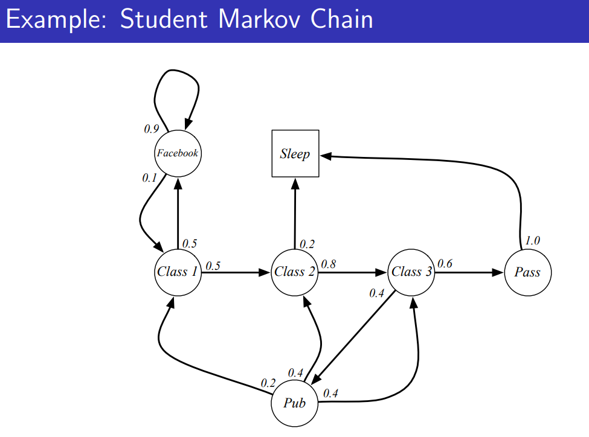
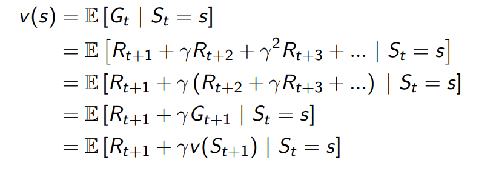
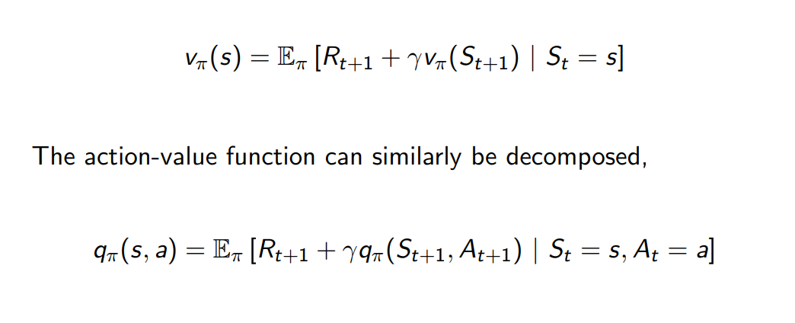
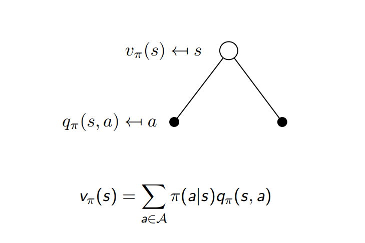
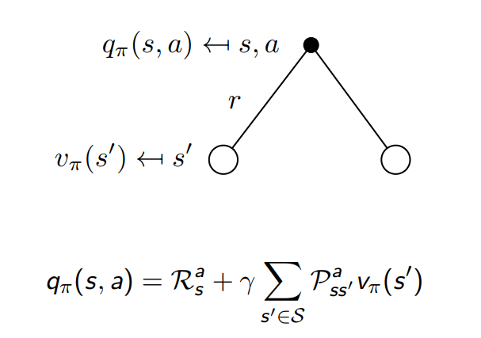
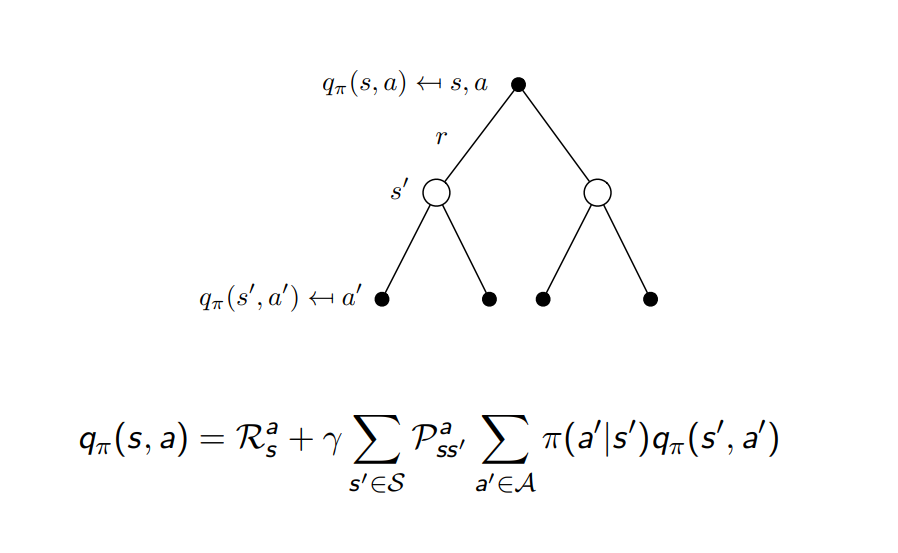
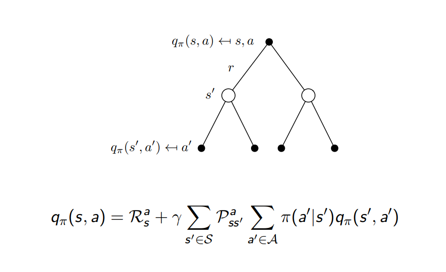

# Lecture 2

## links
* [slides](https://www.davidsilver.uk/wp-content/uploads/2020/03/MDP.pdf)
* [video](https://www.youtube.com/watch?v=lfHX2hHRMVQ&list=PLqYmG7hTraZBiG_XpjnPrSNw-1XQaM_gB&index=4)

## Markov decision processes 
* environment is fully observable
* $\mathbb{P}\left[S_{t+1} \mid S_t\right]=\mathbb{P}\left[S_{t+1} \mid S_1, \ldots, S_t\right]$
*  
* 
* Probabilty transition matrix (i,j) tells the probability to move from state i to state j
* this is an example of a markov chain

* Markov process = (states, probability_of_transition_matrix)

## Markov reward process
* Markov reward process = (states, probability_of_transition_matrix, Reward, discount factor)
* Reward here refers to immediate reward of a state
* but we are more concerned about the cummulative rewards
* return $G_t$, our goal is to maximise the goals
* γ is a discount factor, γ ∈ [0, 1]
*  
* The value of receiving reward R after k + 1 time-steps is $\gamma^k$ R.
* **IMP**
    * γ close to 0 leads to ”myopic” evaluation
    * γ close to 1 leads to ”far-sighted” evaluation
* we have to decide how short or far sighted we should be 
* why should we discount
    * cycles in markov will not coz problemns as they diminish eventually
    * If the reward is financial, immediate rewards may earn more interest than delayed rewards 
    * possible to do $\gamma$=1 if they terminate

## Value function
* long-term value of state s
* $v(s) = E[G_t | S_t =s]$ 
* the return is different for different things
* but the value is the expected value 

## Bellman equation
*  
* the last line just look at that. (law of iterative expectation is used btw)
* how is it useful? we can think of ths as a **one step look ahead tree**
*  
* trying it on the former student markov chain (undiscounted i.e. gamma =1)
*  
* look at the red thingy
* when you exit a state (circle) we will get the reward no matter what
* (WAIT **IMP**) you get a reward no matter is correct but what reward you will get is based on what action your using to exit out of that state
### Bellam equation in matrix form
*  
* this is a linear equation and hence can be solved directly
* computation complexity : o($n^3$), hence not good for large n

## Markov Decision Process
* we add finite set of actions (A) to the former
* A Markov Decision Process is a tuple < S, A,P, R, γ >
*  

### Policy
* $\pi$ is a distribution over actions given states
* state value: s the expected return starting from state s, and then following policy π
*  
* action value: expected return starting from state s, taking action a, and then following policy π
*  
* expansion
*  
* 
* Now computing the terms 
* definions of state value and action value in terms of each other and putting it together in the third slide
* the black filled circles are action
* the white unfilled circles are states
*  
*  
*  
* we can have somthing similar for q
*  
* so basically we have a  2 step look ahead thingy to determine current value
* 
* EXample to solidify the answer.
*  
* AN important thing to not here is that pub's dot is not a state, pub is an action and that has 3 possible ending states unlike study which has 1 end state for that action 

## optimal value function
* we need to find the best behaviour of MDP
* The optimal state-value function $v_∗(s)$ is the maximum value function over all policies
    * $v_∗(s) = max_π \space v_π(s)$
* The optimal action-value function q∗(s, a) is the maximum action-value function over all policies
* 
    * $q_∗(s,a) = max_π \space q_π(s,a)$
* If we have q* then game over we have what is the action scores of each of the action at every state of every policy possible
* reached 1:15
* 
* 
* 
* 

