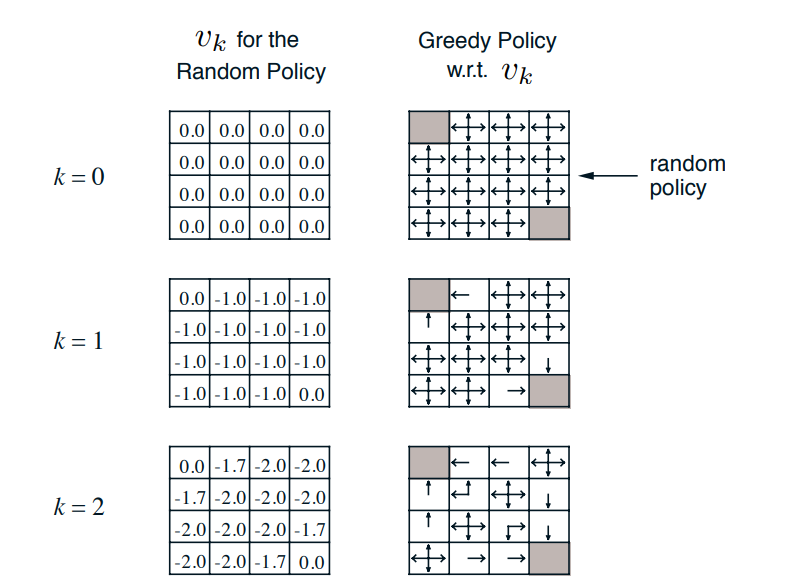

# Lecture 3

Dynamic Programming 
## links
* [video](https://www.youtube.com/watch?v=Nd1-UUMVfz4&list=PLqYmG7hTraZBiG_XpjnPrSNw-1XQaM_gB&index=5)
* [slides](https://www.davidsilver.uk/wp-content/uploads/2020/03/DP.pdf)

## Introduction
* Dynamic Programming requirements
    * Optimal substructure - Optimal solution can be decomposed into subproblems
    * Overlapping subproblems - Subproblems recur many times (hence caching)
* Bellman equation **satisfies both**
    * recursive decomposition
    * value function is the overlapping part. Anything from that state we dont need to re calculate we can use value function
* Planning in MDP 
    * prediction: 
    * control: the best output

## Policy Evaluation
* input: MDP and policy
* output: evaluate a policy 
* we use bellman expectation
* synchronous backups
    * At each iteration k + 1
    * For all states Update $v_{k+1}(s)$ from $v_k(s')$
    * where s' is a successor of s
* This will converge

### example
* we evaluate one policy 
* and we converge to the final v
* $\mathbf{v}^{k+1}=\mathcal{R}^\pi+\gamma \mathcal{P}^\pi \mathbf{v}^k$
* the right side gives us the policy from V.
* policy is like go the best V possible  from every state
* NOTE: we use random policy, without feedback.

## Policy iteration 
* it seems lhs is evaluation and rhs is greedy (both together is policy iteration)
* for above example
    * Given any random policy $\pi$
    * evaluate it i.e the LHS
    * once it converges, compute the RHS policy and that will be the optimal policy 
    * in above example we need to compute RHS only once after the LHS converges 
* but its not always like that.
* 32:55
* 
* 
* 
* 
* 
* 
* 
* 
* 
* 
* 