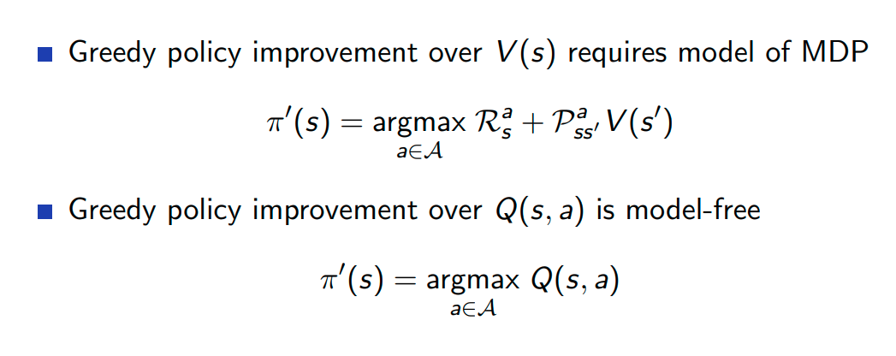

# Lecture 5

## links
* [slide](https://www.davidsilver.uk/wp-content/uploads/2020/03/control.pdf)
* [video](https://www.youtube.com/watch?v=0g4j2k_Ggc4&list=PLqYmG7hTraZBiG_XpjnPrSNw-1XQaM_gB&index=7)

# Model-Free Control

## Introduction

On policy
* learn on the job 
* Learn about policy π from experience sampled from π

Off policy
* “Look over someone’s shoulder”
* Learn about policy π from experience sampled from µ
* basically some samples are already there and we use that

Policy iteration
* evaluation and greedy alternation  (model known MDP known frameworks)
* will it work on monte carlo policy iteration (model free)
    * this requires MDP so that we can look ahead and take the best thing, but in model free we dont know everything
    * so if we do it over V(s) we need the model. 
    * so if we do it over Q(s,a) we dont need anything else its model free
* 
* any more problems?
    * greedy loses out on exploration
    * we mi8 end up in local maxima without reaching global maxima
* How can ensure exploration in agreedy setting

$\epsilon$-Greedy Exploration
* with $\epsilon$/m probabilty you choose a random action
* with 1 - $\epsilon$/m , you choose the greedy action
* so with a small probabilty we explore everything
* theorem: this improves pakka

We dont need to always fully evalute
* 

GLIE
* we need to explore during inital stages, but during production we should only use the best and not do exploration 
* Greedy in the Limit with Infinite Exploration (GLIE)
* statment:
    * All state-action pairs are explored infinitely many times,
    * The policy converges on a greedy policy,

## SARSA
* we start off with (state, action) pair
* we see what Reward we get and which state we reach
* then we take the next action (SARSA)
* 
* Sarsa convergees
* **basically this is TD only, but now defined on Q(s,a)**

Not very much understanding but 
01:00:00 

### Windy grid Example

