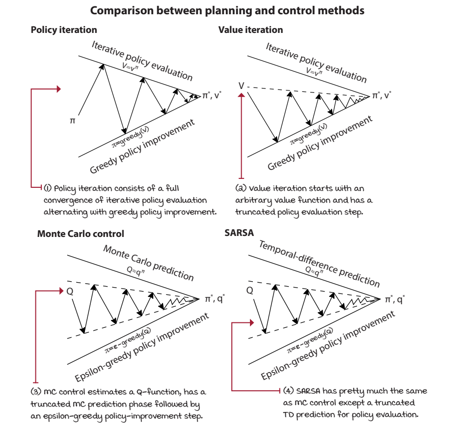

# Chapter 6

* everything is like actor critic in practise

* important - game changer

conditions for which MC control and SARSA converge
* All state-action pairs must be explored infinitely often.
* The policy must converge on a greedy policy.

## Double Q-learning: A max of estimates for an estimate of a max

**Q-learning often overestimates the value function**. Think about this. On every step, we take the maximum over the estimates of the action-value function of the next state. But what we
need is the actual value of the maximum action-value function of the next state. In other words, we’re using the maximum over merely estimates as an estimate of the maximum

The use of a maximum of biased estimates as the estimate of the
maximum value is a problem known as **maximization bias**

It’s simple. Imagine an action-value function whose actual values are all zeros, but the estimates have bias: some positive, some negative: for example, 0.11, 0.65, –0.44, –0.26, and so on. We know the actual maximum of the values is zero, but the maximum over the estimates is 0.65. Now, if we sometimes pick a value with a positive bias and sometimes one with a negative bias, then perhaps the issue wouldn’t be as pronounced. But because we’re always taking a max, we always tend to take high values even if they have the largest bias, the biggest error. Doing this over and over again compounds the errors in a negative way.

**track estimates in two Q-functions**

* a' = one to find the action to estimate from (always from Q1)
* $Q_i = Q_i  + \alpha (r + \gamma.Q_2[s][a'] - Q_i[s][a] )$
* Q_i : is updated with Q1 and Q2 with 50% chance.
* Q = average of both, is passed as value to decide the next next action
* Q = (Q1 + Q2)/2
* V = np.max(Q, axis=1)
* policy is taking argmax of Q

### By now, you
* Know that most RL agents follow a pattern known as generalized policy iteration 
* Know that GPI solves the control problem with policy evaluation and improvement
* Learned about several agents that follow the GPI pattern to solve the control problem

