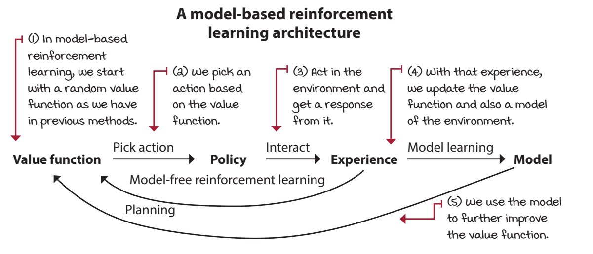

# Chapter 7
## Achieving goals more effectively and efficiently


Planning vs. model-free RL vs. model-based RL
* Planning
    * Refers to algorithms that require a model of the environment to produce a policy
    * Examples of planning algorithms that we’ve learned about in this book are value iteration and policy iteration
* Model-free RL
    *  Refers to algorithms that don’t use models of the environments,  but are still able to produce a policy
    * Several examples of model-free RL algorithms that we have explored in this book are MC, SARSA, and Q-learning.
* Model-based RL
    * : Refers to algorithms that can learn, but don’t require, a model of the environment to produce a policy. The distinction is they don’t require models in advance, but can certainly make good use of them if available, and more importantly, attempt to learn the models through interaction with the environment. 
    * Dyna-Q and trajectory sampling (this chapter) 

## Learning to improve policies using robust targets
* In this section, we discuss control methods similar to SARSA and Q-learning, but use instead the λ-return.

### SARSA(λ)
* differene is instead of TD target we use λ-return 
* target 
* error 
* Q = Q + $\alpha$.error
$$Q = Q + alphas[e] * td_error * \textbf{E}$$
* E is something extra here.

```python
# trying out code by me

sarsa(lambda_)
    state_space, action_space= env.reset
    Q =  init
    Q_track = init

    # lambda function
    select_action = lambda state, Q, epsilon:  np.argmax(Q[state]) \
        if np.random.random() > epsilon else np.random.randint(len(Q[state]))
    
    for epi in num_episodes:
        E = [zeroes]
        state, done = env.Reset , False
        action = select_action(state, Q ,epsilon)

        while not done:
        next_state, reward, done, _ = env.step(action)     
        next_action = select_action(next_state, Q ,*epsilon*)

        target = reward + gamma.Q[next_state,next_action]
        td_error = target - Q[state,action]

        # eligibility stuff
        E[state][action]+=1
        if replacing_traces:
             E.clip(0, 1, out=E)
        # values < min is made to 0
        # values > max is made to 1

        Q = Q + alphas[e] * td_error * E
        
        # We decay the eligibilities.
        E = gamma * lambda_ * E


        state, action = next_state, next_action

        # tracking
        Q_track[e] = Q
        pi_track.append(np.argmax(Q, axis=1))

    V = np.max(Q, axis=1)
    pi = lambda s: {s:a for s, a in enumerate(np.argmax(Q, axis=1))}[s]

    return Q, V, pi, Q_track, pi_track
```
* the above is an on policy (Sarsa kind)

### Watkins’s Q(λ)

* this is an off policy version of λ returns
* Remember, the only change we’re doing here is replacing the TD
target for off-policy control (the one that uses the max over the action in the next state) with a λ-return for off-policy control
* now we also add the eligibilty 
* this is the regular 
```python
td_target = reward + gamma *  Q[next_state].max()
```
* this is still using TD (i wonder y lol)
* this seems Q learning + eligibilty
* DBT: if these methods use TD(lambda) then  why is the target just using single reward instead of n rewards + gamma .Q 

## Agents that interact, learn, and plan

* what if we don’t require an MDP in advance, but
perhaps learn one as we interact with the environment?
* Think about it: as you walk around a new area, you start building a map in your head
* model-based reinforcement learning
* 2 methods
* Model-based methods learn the transition and reward function

### Dyna-Q: Learning sample models
* interleaving a model-free RL method, such as Q-learning, and a planning method, similar to value iteration
* 
* 
* SKipping this for now :
    **will come back later**
* 
* 
* 
* 
* 


